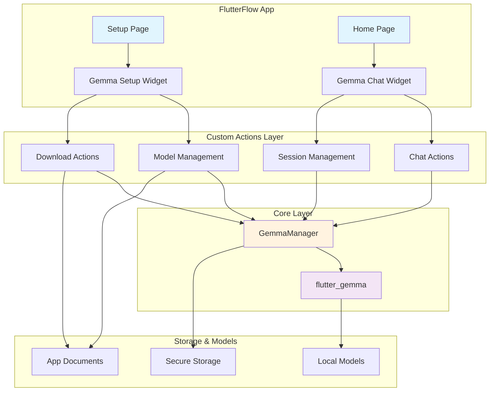

# FlutterFlow Gemma Integration

A complete FlutterFlow integration of Google's Gemma 3 AI models, providing offline/local on-device AI capabilities with authenticated model downloads and real-time chat functionality.

## 🚀 Features

- **🔒 Offline AI**: Run Gemma 3 models completely offline on device
- **🤖 Multiple Models**: Support for various Gemma model variants (nano, 2B, 4B)
- **🔐 Authenticated Downloads**: Secure model downloads from Hugging Face
- **💬 Real-time Chat**: Built-in chat interface with streaming responses
- **🖼️ Multimodal**: Support for text and image inputs (model dependent)
- **⚡ Performance**: Optimized for mobile with CPU/GPU backend support
- **🎨 Ready-to-Use**: Pre-built FlutterFlow pages and custom widgets

## 📱 Pre-built Pages

### 1. Setup Page (`/setup`)
Complete model setup and configuration page featuring:
- **Gemma Authenticated Setup Widget**: Handles model download and initialization
- **Model Selection**: Choose from available Gemma variants
- **Authentication**: Secure Hugging Face token integration
- **Progress Tracking**: Real-time download progress indicators
- **Validation**: Automatic model verification and testing

### 2. Home Page (`/`)
Main chat interface featuring:
- **Gemma Chat Widget**: Full-featured chat interface
- **Message History**: Persistent conversation management
- **Real-time Responses**: Streaming AI responses
- **Multimodal Input**: Text and image message support
- **Model Status**: Live model and session status indicators

## 🛠️ Custom Actions

### Model Management
```dart
// Initialize local model
initializeLocalGemmaModel(
  localModelPath: 'path/to/model.task',
  modelType: 'gemma-3-2b-it',
  preferredBackend: 'gpu',
  maxTokens: 512,
  supportImage: false,
  numOfThreads: 4,
  temperature: 0.7,
  topK: 40.0,
  topP: 0.9,
  randomSeed: 12345,
)

// Download authenticated model
downloadAuthenticatedModel(
  modelNameOrUrl: 'gemma-3-2b-it',
  huggingFaceToken: 'your_token_here',
  onProgress: (downloaded, total, percentage) {
    // Handle progress updates
  },
)

// Manage downloaded models
manageDownloadedModels()

// Close model to free resources
closeGemmaModel()
```

### Chat & Session Management
```dart
// Create new chat session
createGemmaSession(
  temperature: 0.7,
  randomSeed: 12345,
  topK: 40,
)

// Create chat instance
createGemmaChat()

// Send text message
sendGemmaMessage('Your message here')

// Send message with image
sendGemmaMessageWithImage(
  'Describe this image',
  imageBytes,
)
```

### Model Installation
```dart
// Install local model file
installLocalModelFile(
  localFilePath: '/path/to/model.task',
  targetFileName: 'custom_name.task',
)

// Install from app assets
installGemmaFromAsset('assets/models/model.task')

// Get Hugging Face model info
getHuggingfaceModelInfo('google/gemma-3-2b-it')
```

### Utilities
```dart
// Debug model paths and status
debugModelPaths()

// Initialize basic model (legacy)
initializeGemmaModel()

// Download non-authenticated model
downloadGemmaModel('model_url')
```

## 🧩 Custom Widgets

### GemmaAuthenticatedSetupWidget
Complete setup interface for model download and configuration.

**Parameters:**
- `onSetupComplete`: Callback when setup is finished
- `onError`: Error handling callback
- `initialModel`: Default model selection
- `showAdvancedOptions`: Toggle advanced configuration

### GemmaChatWidget
Full-featured chat interface for AI interactions.

**Parameters:**
- `onMessageSent`: Callback for message events
- `onResponse`: Callback for AI responses
- `enableImageInput`: Enable/disable image uploads
- `maxMessages`: Maximum conversation history
- `showTypingIndicator`: Show AI typing status

## 🏗️ Architecture Overview



## 🔄 Typical Workflow

### Option 1: Using Pre-built Pages

1. **Import the project** into your FlutterFlow workspace
2. **Set up navigation** to include `/setup` and `/` routes
3. **Configure state management** using the provided `app_state.dart`
4. **Customize styling** to match your app's theme
5. **Deploy and test** the complete flow

### Option 2: Custom Implementation

1. **Add required dependencies** to your `pubspec.yaml`
2. **Import custom actions** you need
3. **Set up model download flow**:
   ```dart
   // Download model
   final modelPath = await downloadAuthenticatedModel(
     'gemma-3-2b-it',
     'your_hf_token',
     progressCallback,
   );
   
   // Initialize model
   final success = await initializeLocalGemmaModel(
     modelPath,
     'gemma-3-2b-it',
     'gpu',
     512,
     false,
     4,
     0.7,
     40.0,
     0.9,
     12345,
   );
   ```

4. **Create chat session**:
   ```dart
   await createGemmaSession(0.7, 12345, 40);
   await createGemmaChat();
   ```

5. **Handle chat interactions**:
   ```dart
   final response = await sendGemmaMessage('Hello AI!');
   ```

## 📋 Prerequisites

### FlutterFlow Requirements
- **FlutterFlow Pro**: Required for custom actions and widgets
- **Flutter Version**: 3.0.0 or higher
- **Platform Support**: iOS 11+, Android API 21+

### Dependencies
The project includes all necessary dependencies:
```yaml
dependencies:
  flutter_gemma: ^0.9.0
  flutter_secure_storage: ^10.0.0-beta.4
  path_provider: 2.1.4
  http: 1.4.0
  # ... other dependencies
```

### Hugging Face Setup
1. **Create account** at [huggingface.co](https://huggingface.co)
2. **Generate access token** in Settings > Access Tokens
3. **Request access** to Gemma models (if required)
4. **Store token securely** in your app

## 🚀 Quick Start

### Method 1: Clone and Import
```bash
git clone https://github.com/sgardoll/flutterflow_gemma.git
cd flutterflow_gemma
```
1. Import the project folder into FlutterFlow
2. Review and update any app-specific configurations
3. Deploy to your target platforms

### Method 2: Copy Custom Code
1. **Copy custom actions** from `lib/custom_code/actions/` to your project
2. **Copy custom widgets** from `lib/custom_code/widgets/` to your project  
3. **Copy GemmaManager** from `lib/custom_code/GemmaManager.dart`
4. **Add dependencies** from `pubspec.yaml` to your project
5. **Update app state** to include necessary variables

### Method 3: Individual Actions
Select and copy only the actions you need:
- **Basic setup**: `downloadAuthenticatedModel`, `initializeLocalGemmaModel`
- **Chat functionality**: `createGemmaSession`, `sendGemmaMessage`
- **Advanced features**: `sendGemmaMessageWithImage`, `manageDownloadedModels`

## 🔧 Configuration

### Model Selection
Available pre-configured models:
- **gemma-3-nano-e2b-it**: Smallest, fastest (2GB)
- **gemma-3-2b-it**: Balanced performance (2GB)
- **gemma-3-nano-e4b-it**: Enhanced small model (4GB)
- **gemma-3-4b-it**: Highest quality (4GB)

### Performance Tuning
```dart
// GPU backend (recommended for performance)
preferredBackend: 'gpu'

// CPU backend (fallback for compatibility)
preferredBackend: 'cpu'

// Adjust token limits based on device capability
maxTokens: 512,  // Lower for older devices
maxTokens: 1024, // Higher for modern devices

// Temperature controls creativity vs consistency
temperature: 0.1, // More consistent
temperature: 0.9, // More creative
```

### Memory Management
- **Monitor app memory** usage during model initialization
- **Use `closeGemmaModel()`** when switching between models
- **Implement proper lifecycle** management in your pages

## 🐛 Troubleshooting

### Common Issues

**Model Download Fails**
```dart
// Check token validity
getHuggingfaceModelInfo('model-name');

// Verify internet connection
// Ensure sufficient storage space
```

**Model Initialization Fails**
```dart
// Debug model paths
debugModelPaths();

// Try CPU backend fallback
initializeLocalGemmaModel(..., preferredBackend: 'cpu');

// Verify model file integrity
```

**Memory Issues**
```dart
// Reduce max tokens
maxTokens: 256

// Close model between sessions
await closeGemmaModel();

// Use smaller model variant
```

**Performance Issues**
- **Ensure GPU backend** is available and enabled
- **Reduce number of threads** on older devices
- **Lower temperature and topK** values for faster inference

### Debug Actions
Use the provided debug actions to diagnose issues:
```dart
// Check all model paths and status
await debugModelPaths();

// List downloaded models
await manageDownloadedModels();
```

## 🏆 Best Practices

### Security
- **Store HF tokens securely** using `flutter_secure_storage`
- **Validate model files** before initialization
- **Handle authentication errors** gracefully

### Performance
- **Initialize models once** and reuse sessions
- **Implement proper loading states** for better UX
- **Monitor memory usage** especially on older devices
- **Use appropriate model sizes** for your target devices

### User Experience
- **Show download progress** for large models
- **Implement offline indicators** when models are available
- **Provide fallback options** when models aren't available
- **Handle errors with user-friendly messages**

## 📚 API Reference

### GemmaManager Methods
```dart
class GemmaManager {
  Future<bool> initializeModel({...});
  Future<bool> createSession({...});
  Future<String> sendMessage(String message);
  Future<void> closeModel();
}
```

### Action Parameters
Each custom action includes comprehensive parameter validation and error handling. Refer to individual action files for detailed parameter descriptions and usage examples.

## 🤝 Contributing

Contributions are welcome! Please:

1. **Fork the repository**
2. **Create a feature branch** (`git checkout -b feature/amazing-feature`)
3. **Commit your changes** (`git commit -m 'Add amazing feature'`)
4. **Push to the branch** (`git push origin feature/amazing-feature`)
5. **Open a Pull Request**

## 📄 License

This project is licensed under the MIT License - see the [LICENSE](LICENSE) file for details.

## 🙏 Acknowledgments

- **Google** for the Gemma model family
- **Hugging Face** for model hosting and distribution
- **FlutterFlow** for the visual development platform
- **flutter_gemma** package contributors

## 📞 Support

- **Issues**: [GitHub Issues](https://github.com/sgardoll/flutterflow_gemma/issues)
- **Discussions**: [GitHub Discussions](https://github.com/sgardoll/flutterflow_gemma/discussions)
- **FlutterFlow Community**: [FlutterFlow Forum](https://community.flutterflow.io)

---

**Note**: This project requires a Hugging Face account and appropriate model access permissions. Model performance varies by device capabilities and selected backend configuration.
